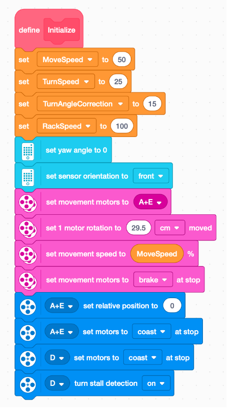

# SuperCharged Mission Notes

MOTORS
|PORT|MOTOR|
|--|--|
|A|LEFT |
|E|RIGHT |
|C|BACK |
|D|FRONT|

SENSORS
|PORT|Sensor|
|--|--|
|B|COLOR RIGHT|
|F|COLOR LEFT|

## Measurements
### Gyro Turns
|SPEED|Expected|Actual|Correction|
|--|--|--|--|
|25%|90 Deg|85 Deg|5 Deg|
|50%|90 Deg|70 Deg|20 Deg|

### Move Tank
|Speed|Expected|Actual|Correction|
|--|--|--|--|
|25%|1 Rotation|28.5 cm|Avg. 28cm|
|25%|2 Rotation|56 cm||
|50%|1 Rotation|29.5 cm|25% + 1cm|
|50%|2 Rotation|57 cm||
|75%|1 Rotation|31.5 cm|50% + 2cm|
|75%|2 Rotation|59 cm||

## My Blocks
### Initialize

### Turns
|Gyro Left|Gyro Right|
|--|--|
|||

### Rack
|Rack Up|Rack Dwon|
|--|--|
|||

